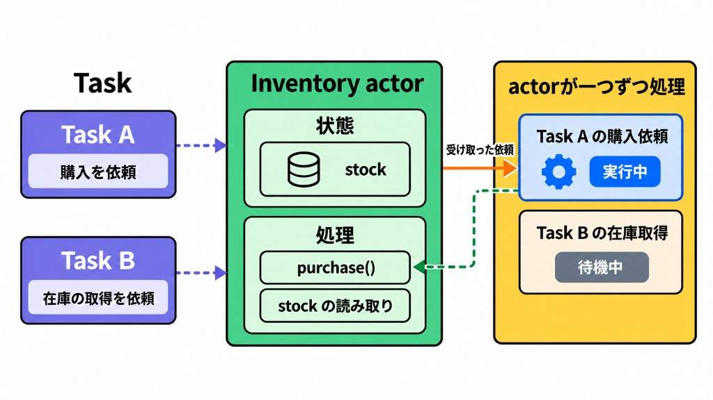

「可変状態を安全に共有する」という問題はSwiftに限らず考えられてきました。そして、その基礎研究により生まれたのが**アクターモデル**です。1970年代から並行処理の研究で使われてきたモデルであり、Swift Concurrencyではこれを採用しました。

[Wikipediaのアクターモデルの説明](https://en.wikipedia.org/wiki/Actor_model)を日本語にすると、次のようになります。

> アクターは受け取ったメッセージに応じて、内部で判断を下し、アクターをさらに作り、メッセージを送り、次のメッセージへの応答方法を決められる。アクターは自身の非公開の状態を変更できるが、ほかのアクターに影響を与えられるのはメッセージを通じてだけである。

つまり、アクターモデルでは並行して動く処理を、それぞれが自分の状態を持つ主体として捉えます。この主体をアクターと呼びます。

アクターには、次の特徴があります。

- 自分が管理する状態を持つ
- 受け取ったメッセージに応じて処理する
- 自分の状態を変更できる
- ほかのアクターへメッセージを送れる

アクターの内部状態を変更するのは、そのアクター自身です。在庫を減らしたいときは、在庫を管理するアクターへ「商品を一つ購入する」という処理を依頼します。



二つのTaskが在庫の値を直接変更するのではなく、在庫を管理するアクターへ処理を依頼する。アクターは受け取った依頼を一つずつ処理し、自分の状態を変更する。

状態と、その状態を扱う処理を一つの主体へまとめることで、データ競合が防がれます。Swiftは、このアクターモデルの考え方を言語機能として取り入れています。

ではここからは、Swift Concurrencyの`actor`を解説します。

Swift Concurrencyでは、このアクターを`actor`という型で表現します。管理する状態はプロパティ、状態を更新はメソッドとして実装します。
実際に、在庫をアクターモデルで表現したものが以下です。


```swift
actor Inventory {
    var stock = 1

    func purchase() -> Int {
        stock = stock - 1
        return stock
    }
}
```

`stock`は、この`Inventory`が管理する在庫数です。在庫を減らす処理は`purchase()`メソッドで実装されています。

そして、アクターの外からメソッドを通さず、状態を更新することはできません。

```swift
let inventory = Inventory()

inventory.stock = 0 // コンパイルエラー
```

状態を変えたいときは、`purchase()`を呼ぶ必要があります。つまり、アクターの状態を更新するためには、そのアクターを通す必要があります。そして、アクターは一度に一つの処理しか行いません。なので、アクターの状態を更新したい外側のプログラムは、他にもアクターを操作したいプログラムと同期する必要があります。つまり、一定期間呼び出しもとはアクターを操作するのを待たされる可能性があります。
そこで、Swiftではアクターの外からアクターを触る場合は、`await`をつけて操作する必要があります。

```swift
func buy(from inventory: Inventory) async {
    let remaining = await inventory.purchase()
    print(remaining)
}
```

呼び出す時には`await`が必要ですが、`purchase()`の宣言に`async`はありません。アクターの中からアクターの状態を更新することに同期は必要ないため、actorの定義の中では`async`をつける必要はありません。外側から状態に触る時のみ、`await`が必要になります。
