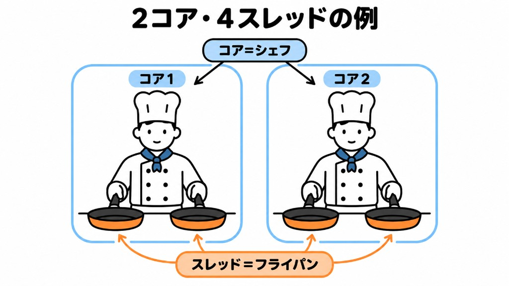
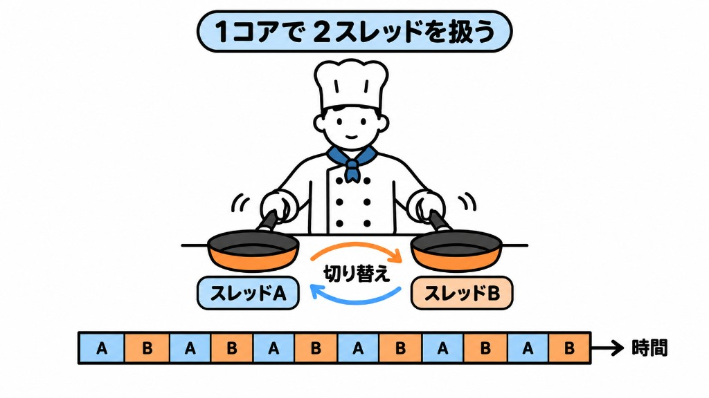

Swiftのコードはコンパイルされた後、実行時にはCPU上で動きます。

CPUの仕様には、多くの場合に「何コア・何スレッド」という表記があります。

これらはそれぞれ以下を意味します。
- CPUの**コア**は実際に命令を実行する単位を指す。料理を作るシェフの数と例えるとわかりやすいかもしれません。

- CPUの**スレッド**はOSが同時に認識し、処理できる作業枠の数を指します。こちらは、シェフが扱えるフライパンの数と例えるとわかりやすいかもしれません。

最近のCPUにはマルチスレッディングという技術があり、一つのコアが複数のスレッドにおける処理を高速に、交互に行います。
この技術により、見かけ上はCPUが複数のスレッドの処理を同時に実行しているように見えます。

