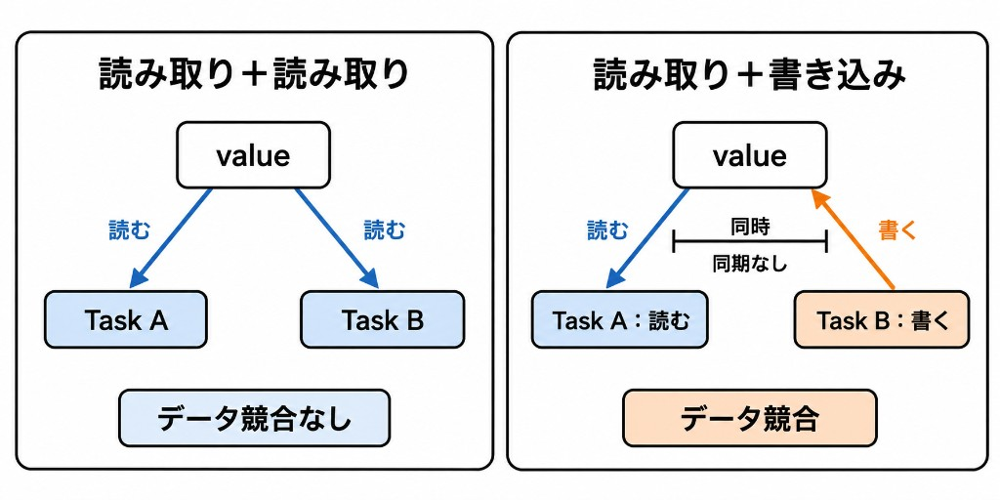

データ競合は、次の三つが同時に成り立つときに発生します。

- 複数の処理が、同じ状態へ同時にアクセスする
- 少なくとも一方の処理が、その状態に**書き込み処理**をする
- それらのアクセスが同期されていない

複数の処理が同じデータを**読み取る**だけなら、データ競合にはなりません。一方が**書き換える**場合は、読み取りと書き込みが同時に行われないように、同期してあげる必要があります。
そして、これができていない場合にデータ競合が発生します。



例えば、書き換え可能な`Counter`を二つのTaskで共有する場面を考えます。

```swift
final class Counter {
    var value = 0

    func increment() -> Int {
        value = value + 1
        return value
    }
}

func runExample() {
    let counter = Counter()

    Task.detached {
        print(counter.increment())
    }
    Task.detached {
        print(counter.increment())
    }
}
```

`increment()`は、`value`を読み取り、1を足し、その結果を書き戻します。二つのTaskが同時に実行すると、両方が`0`を読み、両方が`1`を書き戻す可能性があります。
このようなデータ競合が実際に起こった場合にはどうなるでしょうか。
実際には、以下のようにエラーが発生してクラッシュしたり、不正なデータが発生してしまいます。


